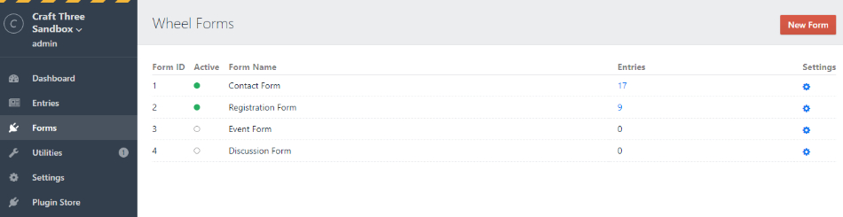

# Wheel Form plugin for Craft CMS 3.x

Free Form Builder with Database Integration, successor of Free Contact Form Plugin featured on [Straight Up Craft](https://straightupcraft.com/)



## Requirements

This plugin requires Craft CMS 3.0.0 or later.

## Installation

To install the plugin, follow these instructions.

1. Open your terminal and go to your Craft project:

        cd /path/to/project

2. Then tell Composer to load the plugin:

        composer require xpertbot/craft-wheelform

3. In the Control Panel, go to Settings → Plugins and click the “Install” button for Wheel Form.

## Features
- reCaptcha Validation
- Export CSV File
- Custom Email HTML Template
- Template variables for easy development
- Email Validation based on field type selected
- Form Field Type for sections
- Required Fields
- Checkbox options
- File extension restriction
- Honeypot Field
- Ajax and Redirect friendly
- Send Form submissions to multiple emails
- Advanced Permissions per form
- Reordering of fields
- Save Uploaded files to Asset Manager
- Multiple Translations
- Export / Import Fields between different websites

## Usage
After successful installation go to Plugin Settings and add the email you would like the forms to send `FROM`. As well as set other useful settings.

Forms are administered at the forms panel main settings. Set where this form should be submitting `TO` as well as name of the form.

Field Settings can be set as Required or not, for validation purposes.

Current Field types supported are:
* Text
* Textarea
* Email
* Number
* Checkboxes
* Radio
* Select
* Hidden
* File
* List
* HTML

## Template Variables
- wheelform
    - settings
    - form
        - recaptcha
        - open()
        - close()
        - fields
            - type
            - name
            - label
            - items
            - fieldClass
            - containerClass
            - required
            - order
            - value
        - entries
            - id
            - formId
            - fields
                - name
                - label
                - value
                - type
            - date
    - lastSubmission
        - id
        - formId
        - fields
            - name
            - label
            - value
            - type

- wheelformErrors (Array of errors based on field name, form, recaptcha, honeypot).

- values (Array of User submitted values based on field name).

## Form Configuration Options
These are configuration opens you can pass to `wheelform.open` to configure your form.

- `id`: **Required** ID of the form being used.
- `redirect`: URL where form will redirect to after a successful submission.
- `registerScripts`: Boolean to load Scripts before `wheelform.open` call (This is useful for caching forms and templates). Defaults to False.
- `refreshCsrf`: Boolean to load Javascript that will refresh the CSRF token for the form on the current page (This is useful for caching forms and templates). In order for this to work `form.open()` needs to be outside the `` block.
- `attributes`: Key: Value Array of Attributes for the current form. Example:
```twig
{# Note: Form attributes take presedence over default values #}
attributes: {
    'novalidate':"novalidate",
    'id':'custom-form',
    'class': 'custom-form',
}
```
- `submitForm`: Configuration options for the submitButton. Example:
```twig
{# SubmitButton options:
    "type" can be button, or input
    "html" attribute takes precedence over the other properties,
    "attributes" is an easy way to add attributes to the button, all attributes are optional #}

submitButton: {
    "type": "button",
    "label": "Send", // Text displayed for the button
    "attributes": { // Array of attributes for the Button. Same as Form
        "class": "btn btn-success",
        "id": "submit-btn",
        "data-submit": "Foo",
    },
    "html": "<span><button>Custom Button</button></span>", // Custom HTML Overwrittes any other options and will render it as final.
}
```

## Template Structure

Your form template can look something like this:

```twig

    
        <ul class="errors">
            
                <li>{{ error }}</li>
            
        </ul>
    





{{ form.open() }}
    {{ wheelformErrors['form'] is defined ? errorList(wheelformErrors['form']) }}
    {{ wheelformErrors['recaptcha'] is defined ? errorList(wheelformErrors['recaptcha']) }}
    {{ wheelformErrors['honeypot'] is defined ? errorList(wheelformErrors['honeypot']) }}

    
        {{ field.render() }}
        {{ wheelformErrors[field.name] is defined ? errorList(wheelformErrors[field.name]) }}
    
{{ form.close() }}
```
Advanced templating:

```twig

    
        <ul class="errors">
            
                <li>{{ error }}</li>
            
        </ul>
    





{{ form.open() }}
    {{ wheelformErrors['form'] is defined ? errorList(wheelformErrors['form']) }}
    {{ wheelformErrors['recaptcha'] is defined ? errorList(wheelformErrors['recaptcha']) }}
    {{ wheelformErrors['honeypot'] is defined ? errorList(wheelformErrors['honeypot']) }}

    
        
            
                <div class="form-checkbox">
                
                <label><input class="checkbox" type="checkbox" value="{{ item }}" {{values[field.name] is defined and item in values[field.name] ? ' checked="checked"' : '' }} name="{{field.name}}[]" id=""/>{{item}}</label>
                
                </div>
            
                <div class="form-radio">
                
                <input class="radio" type="radio" value="{{ item }}" {{values[field.name] is defined and item == values[field.name] ? ' checked="checked"' : '' }} name="{{field.name}}" id=""/>
                <label>{{item}}</label>
                
                </div>
            
                <div class="form-select">
                <select id="wf-select" name="{{field.name}}" class="wf-field {{field.fieldClass}}">
                
                    <option value="{{ item }}" {{values[field.name] is defined and item == values[field.name] ? 'selected="selected"' : '' }}>{{item}}</option>
                
                </select>
                </div>
            
                <div class="form-group">
                    <label>{{field.label}}</label>
                    <input type="file" name="{{field.name}}" id=""/>
                </div>
            
                <div class="form-group">
                    <label>{{field.label}}</label>
                    <textarea class="form-control" name="{{field.name}}" id="">{{ values[field.name] ?? '' }}</textarea>
                </div>
            
                <div class="form-group">
                    <label>{{field.label}}</label>
                    <input type="text" name="{{field.name}}[]" id=""/>
                    <script>//Javascript to handle adding fields</script>
                </div>
            
                <div class="form-group">
                <label>{{field.label}}</label>
                <input class="form-control" type="{{field.type}}" value="{{ values[field.name] ?? '' }}" name="{{field.name}}" id=""/>
                </div>
        
        {{ wheelformErrors[field.name] is defined ? errorList(wheelformErrors[field.name]) }}
    
    
        <div>
            <script src="https://www.google.com/recaptcha/api.js"></script>
            <!-- Production captcha -->
            <div class="g-recaptcha" data-sitekey="{{wheelform.getSettings('recaptcha_public')}}"></div>
        </div>
    

    <button class="btn btn-success" id="submit">Send</button>

</form>
```

If you want to stick to HTML and not use the variables:

```twig

    
        <ul class="errors">
            
                <li>{{ error }}</li>
            
        </ul>
    




    {{ wheelformErrors['form'] is defined ? errorList(wheelformErrors['form']) }}

    <form method="post" action="" accept-charset="UTF-8" novalidate="" enctype="multipart/form-data">
    {{ csrfInput() }}
    <input type="hidden" name="action" value="wheelform/message/send">
    <input type="hidden" name="form_id" value="1">
    <input type="hidden" name="redirect" value="{{ 'contact/thanks'|hash }}">

    <h3><label for="from-name">Your Name</label></h3>
    <input id="from-name" type="text" name="name" value="{{ values['name'] ?? '' }}">
    {{ wheelformErrors['name'] is defined ? errorList(wheelformErrors['name']) }}

    <h3><label for="from-email">Your Email</label></h3>
    <input id="from-email" type="email" name="email" value="{{ values['email'] ?? '' }}">
    {{ wheelformErrors['email'] is defined ? errorList(wheelformErrors['email']) }}

    <h3><label for="phone">Phone</label></h3>
    <input id="phone" type="text" name="phone" value="{{ values['phone'] ?? '' }}">
    {{ wheelformErrors['phone'] is defined ? errorList(wheelformErrors['phone']) }}

    <label><input type="checkbox" name="favorite_topping[]" value="Chocolate">Chocolate</label>
    <label><input type="checkbox" name="favorite_topping[]" value="Vanilla">Vanilla</label>
    <label><input type="checkbox" name="favorite_topping[]" value="Strawberry">Strawberry</label>
    {{ wheelformErrors['favorite_topping'] is defined ? errorList(wheelformErrors['favorite_topping']) }}

    <h3><label for="message">Message</label></h3>
    <textarea rows="10" cols="40" id="message" name="message">{{ values['message'] ?? '' }}</textarea>
    {{ wheelformErrors['message'] is defined ? errorList(wheelformErrors['message']) }}

    <input type="file" name="user_file" id="user_filer">

    {# if using recaptcha settings #}
    <div class="recaptcha-container">
        <script src="https://www.google.com/recaptcha/api.js"></script>
        <div class="g-recaptcha" data-sitekey="{{ site_key }}">
        </div>
    </div>

    <input type="submit" value="Send">
</form>
```

### Redirecting after submit

If you have a ‘redirect’ hidden input, the user will get redirected to it upon successfully sending the email.

Note that if you don’t include a `redirect` input, the current page will get reloaded.

### Displaying flash messages

When a contact form is submitted, the plugin will set a `success` flash message on the user session. This is so, you can have a success message after the form has been submitted and can be displayed on redirected page. You can display it in your template like this:

```twig

    <p class="message success">{{ craft.app.session.getFlash('wheelformSuccess') }}</p>

```

### Form Field Type
You can assign a Field Type to your sections where Users can select which form to display based on a Dropdown. This field will return a `wheelform.form` template service (same as other examples) that belongs to the form selected on the Admin Panel. if you need to customize it you can use the `setConfig` variable to modify the default behaviour.

```twig

```

### Displaying the last/current submission
Similar to the flash message (will only be available after submission), when a contact form is submitted the plugin will store the values of the submitted form in the session and make it available (once) through the `wheelform.lastSubmission` variable. You can use this in the template (typically in your re-direct page) like this:
```twig


    <dl>
        
            <dt>{{ field.label }}</dt>
            <dd>{{ field.value }}</dd>
        
    </dl>

```
You also have available `submission.id`, `submission.formId` and `submission.date`
(Note: `submission.date` is a DateTime object run it through `date()` filter).

### Recaptcha V3
```twig
{# You need to add the Recaptcha Init before the form.open() #}
{# action is optional, action defaults to form URL #}
{{ wheelform.recaptchaV3({'action': 'contact-form'})}}
```

### Displaying existing form submissions
You can access existing submitted form entries on a form through the `form.entries` property:

```twig


{# form.entries(start, limit) can be used for pagination purposes #}


{# form.fields returns active form fields #}


<table>
<thead>
    
        <th>{{ field.label }}</th>
    
    <th>Date</th>
</thead>
<tbody>
    
        <tr data-id="{{ entry.id }}">
            
                
                <td data-id="{{ current.name }}">{{ current.value }}</td>
            
            <td data-id="date">{{ entry.date|date("m/d/Y") }}</td>
        </tr>
    
</tbody>
```

### Displaying specific Form Submission
You can access specific form entry by loading the form and requesting it by ID:

```twig



    <p>{{ field.value }}</p>

```

### File attachments

If you would like your form to accept file attachments, follow these steps:

1. Make sure your opening HTML `<form>` tag contains `enctype="multipart/form-data"`.
2. Add a `<input type="file" name="{field_name}">` to your form.

### File saving to asset Folder
On Plugin Settings select the Folder you would like to save files. Make sure `Allow public URLs` option is turned on.


### Ajax form submissions

You can optionally post contact form submissions over Ajax if you’d like. Just send a POST request to your site with all of the same data that would normally be sent:

```js
$('#my-form').submit(function(ev) {
    // Prevent the form from actually submitting
    ev.preventDefault();

    var data = $(this).serialize();

    // Send it to the server
    $.post('/wheelform/message/send',
        data,
        function(response) {
            if (response.success) {
                //reponse.message is the message saved in the Form Settings
                $('#thanks').fadeIn();
            } else {
                // response.values will contain user submitted values
                // response.errors will be an array containing any validation errors that occurred, indexed by field name
                // e.g. response.error['email'] => ['Email is required', 'Email is invalid']
                alert('An error occurred. Please try again.');
            }
        }
    );
});
```

If using getCrsfInput() make sure you are submitting it with the rest of your form.

### Permissions
There are 4 different type of permissions ({Form Name} permissions are repeated per form on your website):
- Create new Form - Allows User / Group to see the "New Form" button and create new forms.
- Edit {Form Name} - Allows User / Group to see the form on the list of forms.
    - {Form Name} Entries - Allows User / Group to view the Entries list.
    - {Form Name} Settings - Allows User / Group to Edit the form settings.

### Form Tools
- CSV Exporter can be based on entry date, under Admin > Utilities > Form Tools.
- Form Fields can be exported as a JSON file.
- Form Fields can be imported from a valid JSON file.

### Delete Messages Cron Job
You can schedule a Cron Job on your server to run daily an check to Delete any old Messages values saved on your database. The cron Job Command is:
`php var/www/yourwebsite/craft wheelform/message/purge` where `var\www\yourwebsite\craft` is the path to the craft executable package.

The only configuration needed inside `config\wheelform.php` is:

```php
return [
    'purgeMessages' => true, //True / False value to allow Cron Job to go
    'purgeMessagesDays' => 30, //Number of days messages should live in your database
];
```

Note: This action cannot be reverted.

### Custom Email Template
Email Templates are Optional. Custom Twig templates can be used using these steps:

1. Create `wheelform.php` file inside Craft's config folder.
2. `wheelform.php` expects an array of configuration settings to be returned. The options are:
    - `template`: default template to use for all emails.
    - `notification`: default notification template overwrite.
    - `forms`: is an array that overwrites any settings specific to the form. They key on each array is the ID of the form to modify. (These settings take priority over anything else)

```php
return [
    'template' => '_emails/custom',
    'notification' => [
        'template' => '_emails/notification',
        'subject' => 'Default Notification Subject',
    ],
    'forms' => [
        1 => [
            'template' => '_emails/form1_template',
            'notification' => [
                'template' => '_emails/notification2',
                'subject' => 'Form specific Subject',
            ],
        ],
        3 => [
            'template' => '_emails/form3_template',
        ],
    ],
];
```
3. Inside your templates you will have access to a `fields` array and `notification_message` with the message set on the Form Administration Panel.
Example:

```html
<html>
<body>
    <h1>Custom Template</h1>

    <ul>
    
        <li>
        <strong>{{ field.label }}:</strong>
        

            
                {# This is an object with file attributes #}
                {{ field.value.name }}

            
                {# Array of all choices selected #}
                {{ field.value | join(',')}}
            
                
                    <ul>
                    
                        <li>{{ item }}</li>
                    
                    </ul>
                

            

                {# Text based items #}
                {{ field. value }}

        
        </li>
    
    </ul>
</body>
</html>
```

### Honeypot Field
Honeypot field is a field that is meant to be left blank by humans. Usually hidden by CSS. [More information](https://stackoverflow.com/questions/36227376/better-honeypot-implementation-form-anti-spam) about Honeypot fields.

If not using `{{ form.close() }}` helper tag make sure you add a text field with the name you used when creating the form. Then, hide it from the user using CSS or Javascript.

### Events
(Note: this is mostly for developers that know basic PHP and Composer Packages)

`beforeSave` Event, this allows developers to modify the value Active Records objects before being saved to the database, these changes cascade into the other Events and Mailers.

`beforeSend` Event, this allows developers to modify the fields being sent in an email, this event does not modify the values entered in the database. Only the fields being sent to the client.

`afterSend` Event, Final Values sent to the user email, perfect for Third Party integrations and libraries.

You can also trigger other custom functionality such as gathering custom field values to add to a Third party service such as a Mailing list.

`beforeSend` and `afterSend` object is as follows:
`Event` class properties:
* `form_id` - Current ID of form being submitted, This allows developers some way to check what fields are being sent.
* `subject` - Subject of the currnet form. This can be modified to make it customizable.
* `message` - Associative Array of different fields with the values submitted.
* `from` - Email Address message is being send From.
* `to` - Email Address message is being send To (This can be an array of multiple emails).
* `reply_to` - Email Address message can be Reply To.
* `email_html` - Full HTML String that will be sent in the email. This overwrites other email templates.

Example Plugin to handle these events. [wheelformhelper](https://github.com/xpertbot/wheelformhelper)

### Translations
New translations can be submitted using the format inside the translations folder. (I will keep "es" translations up to date as much as possible, that can be a good starting point for your translations)
